# CONTEXT 

A restaurant needs help to stay afloat. 
Three kinds of food : sushi, curry and ramen. 

The restaurant has captured some very basic data from their few months of operation but have no idea how to use their data to help them run the business

# PROBLEM STATEMENT 

Danny wants to use the data to answer a few simple questions about his customers, especially about their visiting patterns, how much money they’ve spent and also which menu items are their favourite. Having this deeper connection with his customers will help him deliver a better and more personalised experience for his loyal customers.

**The restaurant's owner plans to expand the existing customer loyalty program.**

# DATASETS 

Three datasets : 
* sales 
* menu 
* members 

## ERD 


## TABLE 1 : SALES 

The `sales` table is composed of : 
- **customer_id** - FOREIGN KEY 
- **order_date** - Date when the product is ordered by the customer. 
- **product_id** - FOREIGN KEY - id of the product that was ordered

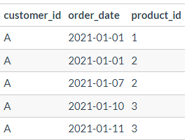

## TABLE 2 : MENU

The `menu` table is composed of : 
- **product_id** - PRIMARY KEY 
- **product_name** - Name of the product
- **price** - Price in $ 
of the product

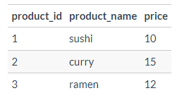

## TABLE 3 : MEMBERS 

The `members` table is composed of : 
- **customer_id** - PRIMARY KEY 
- **join_date** - When a customer joined the beta version of the Danny’s Diner loyalty program.

# CASE STUDY 

**Init**

```sql
DROP SCHEMA IF EXISTS v_dannys_diner CASCADE; 
CREATE SCHEMA v_dannys_diner;

DROP VIEW IF EXISTS v_dannys_diner.sales_menu;
CREATE VIEW v_dannys_diner.sales_menu AS 
SELECT 
  sales.customer_id, 
  sales.order_date,
  sales.product_id, 
  menu.product_name, 
  menu.price, 
  ROW_NUMBER() OVER(
    PARTITION BY sales.customer_id
    ORDER BY order_date
  ) AS ranking_date, 
  join_date, 
  CASE 
    WHEN join_date IS NULL THEN 'N'
    WHEN join_date > order_date THEN 'N'
    ELSE 'Y'
  END AS member
FROM dannys_diner.sales
LEFT JOIN dannys_diner.menu
  ON sales.product_id = menu.product_id
LEFT JOIN dannys_diner.members
  ON sales.customer_id = members.customer_id;
```

## **Q1**
> What is the total amount each customer spent at the restaurant?

```sql
SELECT 
  customer_id, 
  SUM(price) AS total_price
FROM v_dannys_diner.sales_menu
GROUP BY 1
ORDER BY 2 DESC; 
```
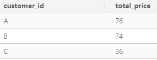


## **Q2**

> How many days has each customer visited the restaurant?

```sql
SELECT 
  customer_id, 
  COUNT(DISTINCT order_date) AS days_visiting_number
FROM v_dannys_diner.sales_menu 
GROUP BY 1
ORDER BY 2 DESC; 
```

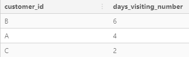

## **Q3**

> What was the first item from the menu purchased by each customer? 

```sql
SELECT DISTINCT 
  customer_id, 
  product_name AS first_purchased_product
FROM v_dannys_diner.sales_menu
WHERE ranking_date = 1;
```

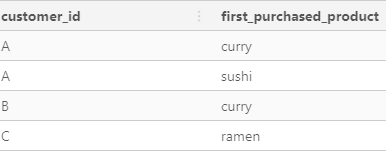

## **Q4**

> What is the most purchased item on the menu and how many times was it purchased by all customers?

```sql
SELECT 
  product_name, 
  COUNT(*) AS total_pourchases
FROM v_dannys_diner.sales_menu
GROUP BY 1 
ORDER BY 2 DESC
LIMIT 1;
```

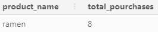

## **Q5**

> Which item was the most popular for each customer?

```sql
WITH cte_count AS (
  SELECT 
    customer_id, 
    product_name, 
    COUNT(*) AS total_pourchases
  FROM v_dannys_diner.sales_menu
  GROUP BY 1, 2
),
cte_ranking AS (
  SELECT 
    *, 
    RANK() OVER(
      PARTITION BY customer_id
      ORDER BY total_pourchases DESC
    ) AS ranking_count
  FROM cte_count
)
SELECT 
  customer_id,
  product_name, 
  total_pourchases 
FROM cte_ranking
WHERE ranking_count = 1;
```
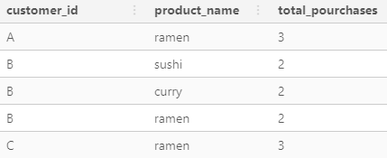

## **Q6**

> Which item was purchased first by the customer after they became a member?

```sql
WITH cte_ranking AS (
  SELECT 
    customer_id, 
    product_name,
    order_date, 
    join_date,
    ROW_NUMBER() OVER(
      PARTITION BY customer_id
      ORDER BY order_date
    ) AS ranking_date
  FROM v_dannys_diner.sales_menu
  WHERE join_date IS NOT NULL 
    AND order_date >= join_date 
) 
SELECT
  customer_id, 
  product_name 
FROM cte_ranking
WHERE ranking_date = 1;
```
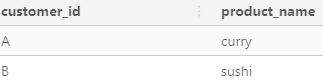

## **Q7**

> Which item was purchased just before the customer became a member? 

```sql
WITH cte_ranking AS (
  SELECT 
    customer_id, 
    product_name,
    order_date, 
    join_date,
    price,
    RANK() OVER(
      PARTITION BY customer_id
      ORDER BY 
        order_date DESC
    ) AS ranking_date
  FROM v_dannys_diner.sales_menu
  WHERE join_date IS NOT NULL 
    AND order_date < join_date::DATE
) 
SELECT
  customer_id, 
  product_name
FROM cte_ranking
WHERE ranking_date = 1;
```

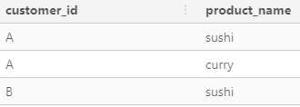

## **Q8**

> What is the total items and amount spent for each member before they became a member?

```sql
WITH cte_before_member AS (
  SELECT 
    customer_id, 
    product_name,
    order_date, 
    join_date,
    price
  FROM v_dannys_diner.sales_menu
  WHERE join_date IS NOT NULL 
    AND order_date < join_date 
) 
SELECT 
  customer_id, 
  COUNT(product_name) AS product_count, 
  SUM(price) AS total_price
FROM cte_before_member 
GROUP BY customer_id;
```
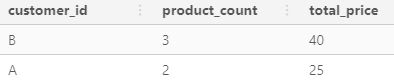

## **Q9**

> If each `$`1 spent equates to 10 points and sushi has a 2x points multiplier - how many points would each customer have?

```sql
WITH cte_points_number AS (
  SELECT 
    customer_id, 
    product_name,
    order_date, 
    join_date,
    price, 
    CASE 
      WHEN product_name = 'sushi' THEN 20 * price
      ELSE 10 * price
    END AS points_number
  FROM v_dannys_diner.sales_menu
) 
SELECT 
  customer_id, 
  SUM(points_number) AS total_points
FROM cte_points_number
GROUP BY 1
ORDER BY 2 DESC;
```

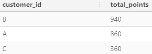

## **Q10**

> In the first week after a customer joins the program (including their join date) they earn 2x points on all items, not just sushi - how many points do customer A and B have at the end of January?

```sql
SELECT 
  customer_id, 
  SUM(
    CASE 
      WHEN product_name = 'sushi' THEN 20 * price
      WHEN order_date BETWEEN join_date::DATE  AND 
      (join_date::DATE+6) THEN 20 * price
      ELSE 10 * price
    END 
  ) AS total_points
FROM v_dannys_diner.sales_menu
WHERE join_date IS NOT NULL
  AND order_date <= '2021-01-31'
GROUP BY 1
ORDER BY 2 DESC;
```
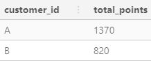


# REVERSE ENGINEERING PART

**Recreate the next table**
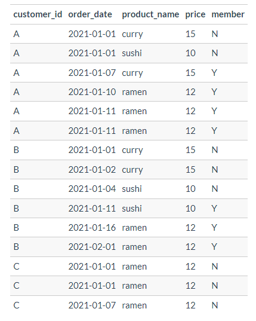

We can do that directly in the view.

```sql
SELECT
  customer_id, 
  order_date, 
  product_name,
  price, 
  member
FROM v_dannys_diner.sales_menu
ORDER BY 1, 2;
```

**Recreate the next table**


```sql
SELECT
  customer_id, 
  order_date, 
  product_name,
  price, 
  member, 
  CASE 
    WHEN member = 'N' THEN NULL 
    ELSE DENSE_RANK() OVER(
      PARTITION BY 
        customer_id,
        member
      ORDER BY 
        order_date, 
        price DESC
    )
  END AS ranking
FROM v_dannys_diner.sales_menu;
```

