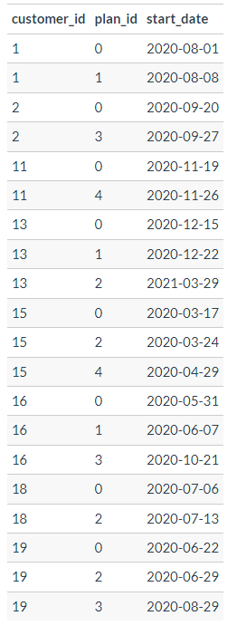
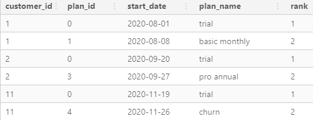
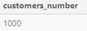
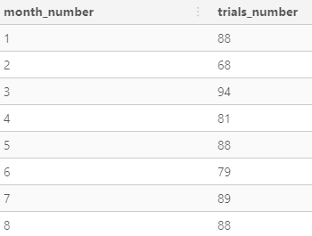
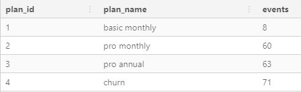
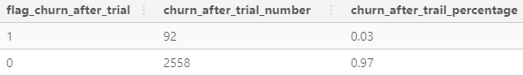
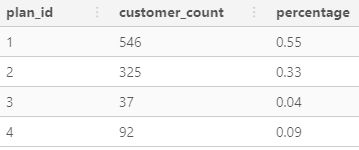
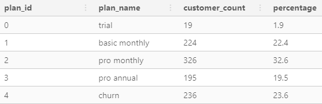
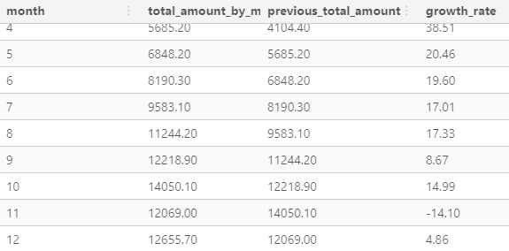
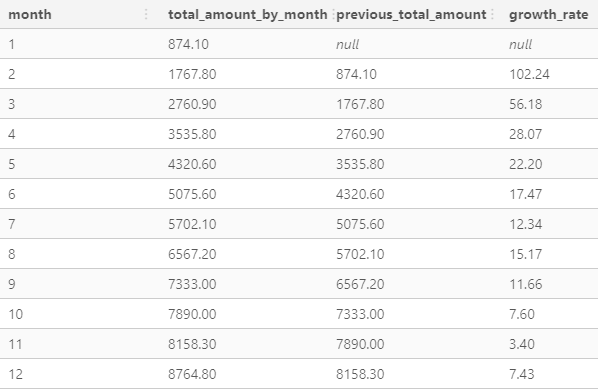

# CONTEXT 

Subscription based businesses are super popular and Danny realised that there was a large gap in the market - he wanted to create a new streaming service that only had food related content - something like Netflix but with only cooking shows!

Danny finds a few smart friends to launch his new startup Foodie-Fi in 2020 and started selling monthly and annual subscriptions, giving their customers unlimited on-demand access to exclusive food videos from around the world!

Danny created Foodie-Fi with a data driven mindset and wanted to ensure all future investment decisions and new features were decided using data. This case study focuses on using subscription style digital data to answer important business questions.

# DATASETS 

Six datasets : 
* plans 
* subscriptions 

# ERD


## TABLE 1 : Plans 

The `plans` table is composed of : 
- **plan_id** - PRIMARY KEY
- **plan_name** - Name of the plan or subscription
- **price** - Monthly price of the subscription


## TABLE 2 : Subscriptions 

The `subscriptions` table is composed of : 
- **customer_id** - PRIMARY KEY
- **plan_id** - FOREIGN KEY
- **start_date** - Starting date of the subscription



# CASE STUDY 

Before we are going to deep into this case study, we have to prepare our work with views (schema + views) : 

```sql
DROP SCHEMA IF EXISTS v_foodie_fi CASCADE; 
CREATE SCHEMA v_foodie_fi; 

DROP VIEW IF EXISTS v_foodie_fi.plans; 
CREATE VIEW v_foodie_fi.plans AS
SELECT * FROM foodie_fi.plans; 


DROP VIEW IF EXISTS v_foodie_fi.subscriptions; 
CREATE VIEW v_foodie_fi.subscriptions AS
SELECT * FROM foodie_fi.subscriptions; 
```

## Customer Journey

```sql
SELECT 
  customer_id, 
  plans.plan_id, 
  start_date, 
  plans.plan_name, 
  RANK() OVER(
    PARTITION BY customer_id
    ORDER BY start_date
  )
FROM v_foodie_fi.subscriptions
INNER JOIN v_foodie_fi.plans 
  ON subscriptions.plan_id = plans.plan_id
WHERE customer_id in (1, 2, 11, 13, 15, 16, 18, 19);
```



- **CUSTOMER 1**
Trial of 7 days then basic monthly subscription 
- **CUSTOMER 2**
Trial of 7 days then annual subscription
- **CUSTOMER 11**
Trial of 7 days then **churn** 
- **CUSTOMER 13**
Basic monthly subscription during 3 months then pro monthly subscription
- **CUSTOMER 15**
Trial of 7 days then pro monthly subscription for one month (**churn** after). 
- **CUSTOMER 16**
Trial of 7 days then basic monthly subscription and after 4 months annual subscription
- **CUSTOMER 18**
Trial of 7 days then pro monthly subscription
- **CUSTOMER 19**
Trial of 7 days then pro monthly subscription and annual subscription after 2 months. 

## Data Analysis Questions

## **Q1**

> How many customers has Foodie-Fi ever had?

```sql
SELECT 
  COUNT(DISTINCT customer_id) AS customers_number
FROM v_foodie_fi.subscriptions;
```


## **Q2**

> What is the monthly distribution of trial plan start_date values for our dataset - use the start of the month as the group by value

```sql
WITH cte_month_distribution AS (
  SELECT 
    *, 
    TO_CHAR(start_date, 'Month') AS month
  FROM v_foodie_fi.subscriptions
  WHERE plan_id = 0
)
SELECT 
  month, 
  COUNT(*) AS trials_number
FROM cte_month_distribution
GROUP BY 1
ORDER BY 2 DESC; 
```



## **Q3**

> What plan start_date values occur after the year 2020 for our dataset? Show the breakdown by count of events for each plan_name

```sql
SELECT 
  plans.plan_id, 
  plans.plan_name, 
  COUNT(*) AS events 
FROM v_foodie_fi.subscriptions
LEFT JOIN v_foodie_fi.plans
  ON subscriptions.plan_id =  plans.plan_id
WHERE start_date > '2020-12-31'
GROUP BY 1, 2
ORDER BY 1; 
```



## **Q4**

> What is the customer count and percentage of customers who have churned rounded to 1 decimal place?

```sql
WITH cte_flag_churn AS (
  SELECT 
    *, 
    CASE 
      WHEN plan_id = 4 THEN 1 
      ELSE 0
    END AS flag_churn 
  FROM v_foodie_fi.subscriptions
)
SELECT 
  flag_churn,
  COUNT(*) AS churn_count,
  ROUND( 
    100 * COUNT(*) / SUM(COUNT(*)) OVER(), 
    1
  ) AS churn_percentage
FROM cte_flag_churn
GROUP BY 1;
```


## **Q5**

> How many customers have churned straight after their initial free trial - what percentage is this rounded to the nearest whole number?

```sql
WITH cte_previous_plan AS (
  SELECT 
    *, 
    LAG(plan_id) OVER(
      PARTITION BY customer_id
      ORDER BY start_date) AS previous_plan 
  FROM v_foodie_fi.subscriptions
),
cte_flag_churn_after_trial AS (
  SELECT
    *, 
    CASE 
      WHEN plan_id = 4 AND previous_plan = 0 THEN 1
      ELSE 0
    END AS flag_churn_after_trial
  FROM cte_previous_plan
) 
SELECT 
  flag_churn_after_trial, 
  COUNT(*) AS churn_after_trial_number, 
  ROUND(COUNT(*) / SUM(COUNT(*)) OVER(), 2) AS churn_after_trail_percentage
FROM cte_flag_churn_after_trial
GROUP BY 1; 
```



## **Q6**

> What is the number and percentage of customer plans after their initial free trial?

```sql
WITH cte_previous_plan AS (
  SELECT 
    *, 
    LAG(plan_id) OVER(
      PARTITION BY customer_id
      ORDER BY start_date) AS previous_plan 
  FROM v_foodie_fi.subscriptions
)
SELECT 
  plan_id, 
  COUNT(*) AS customer_count,
  ROUND(COUNT(*) / SUM(COUNT(*)) OVER(), 2) AS percentage
FROM cte_previous_plan 
WHERE previous_plan = 0
GROUP BY plan_id;
```



## **Q7**

> What is the customer count and percentage breakdown of all 5 plan_name values at 2020-12-31?

```sql
WITH cte_breakdown_2020 AS (
  SELECT 
    customer_id, 
    plan_id, 
    start_date, 
    ROW_NUMBER() OVER(
      PARTITION BY customer_id
      ORDER BY start_date DESC
    ) AS _row_number
  FROM v_foodie_fi.subscriptions
  WHERE start_date <= '2020-12-31'
)
SELECT 
  cte_breakdown_2020.plan_id, 
  plans.plan_name, 
  COUNT(*) AS customer_count, 
  ROUND(100 * COUNT(*) / SUM(COUNT(*)) OVER(), 1) AS percentage
FROM cte_breakdown_2020
LEFT JOIN v_foodie_fi.plans
  ON cte_breakdown_2020.plan_id = plans.plan_id
WHERE _row_number = 1
GROUP BY 1, 2;
```


## **Q8**

> How many customers have upgraded to an annual plan in 2020?

```sql
SELECT 
  COUNT(DISTINCT customer_id) AS customer_count
FROM v_foodie_fi.subscriptions
WHERE plan_id = 3
AND start_date BETWEEN '2020-01-01' AND '2020-12-31';
```

**COUNT : 195**

## **Q9**

> How many days on average does it take for a customer to an annual plan from the day they join Foodie-Fi?

```sql
DROP TABLE IF EXISTS join_date; 
CREATE TEMP TABLE join_date AS (
  WITH cte_join_date AS (
    SELECT 
      *, 
      ROW_NUMBER() OVER(
        PARTITION BY customer_id
        ORDER BY start_date
      ) AS _row_number
    FROM foodie_fi.subscriptions
  )
  SELECT 
    customer_id, 
    start_date AS signup_date
  FROM cte_join_date 
  WHERE _row_number = 1
);


DROP TABLE IF EXISTS date_to_annual_plan; 
CREATE TEMP TABLE date_to_annual_plan AS (
  WITH cte_date_to_annual_plan AS (
    SELECT 
      *, 
      ROW_NUMBER() OVER(
        PARTITION BY customer_id
        ORDER BY start_date DESC 
      ) AS _row_number
    FROM foodie_fi.subscriptions
  )
  SELECT 
    customer_id, 
    start_date AS annual_plan_date
  FROM cte_date_to_annual_plan
  WHERE _row_number = 1
  AND plan_id = 3
); 


WITH cte_days_diff_until_annual_plan AS (
  SELECT 
   date_to_annual_plan.customer_id, 
   join_date.signup_date, 
   annual_plan_date
  FROM date_to_annual_plan
  LEFT JOIN join_date
    ON date_to_annual_plan.customer_id = join_date.customer_id
), 
cte_avg_diff_days AS (
  SELECT 
    customer_id, 
    DATE_PART('day', annual_plan_date::timestamp - signup_date::timestamp) AS days_diff
  FROM cte_days_diff_until_annual_plan
)
SELECT 
  FLOOR(AVG(days_diff)) AS avg_diff_days
FROM cte_avg_diff_days;
```

**AVG : 105**

## **Q10**

> How many customers downgraded from a pro monthly to a basic monthly plan in 2020?

```sql
WITH cte_previous_plan AS (
  SELECT 
    customer_id, 
    plan_id, 
    LAG(plan_id) OVER(
      PARTITION BY customer_id
      ORDER BY start_date DESC
    ) AS previous_plan, 
    start_date
  FROM foodie_fi.subscriptions
  WHERE start_date <= '2020-12-31'
)
SELECT 
  COUNT(*)
FROM cte_previous_plan
WHERE previous_plan = 2
AND plan_id = 1;
```

**COUNT : 163**

# Challenge Payment Question

The Foodie-Fi team wants you to create a new payments table for the year 2020 that includes amounts paid by each customer in the subscriptions table with the following requirements:

- monthly payments always occur on the same day of month as the original start_date of any monthly paid plan
- upgrades from basic to monthly or pro plans are reduced by the current paid amount in that month and start immediately
- upgrades from pro monthly to pro annual are paid at the end of the current billing period and also starts at the end of the month period
- once a customer churns they will no longer make payments

```sql 
DROP TABLE IF EXISTS sub_next_plan; 
CREATE TEMP TABLE sub_next_plan AS (
  SELECT
   customer_id,
   plan_id, 
   start_date, 
   LEAD(subscriptions.plan_id) OVER W AS next_plan, 
   LEAD(start_date) OVER w AS next_date
  FROM foodie_fi.subscriptions
  WHERE plan_id != 0
  AND start_date <= '2020-12-31'
  WINDOW w AS (
    PARTITION BY customer_id
    ORDER BY start_date
  )
); 


/*
SELECT 
  plan_id, 
  next_plan,
  COUNT(*)
FROM sub_next_plan
GROUP BY 1, 2
ORDER BY 1, 2;
*/

DROP TABLE IF EXISTS case_1_2; 
CREATE TEMP TABLE case_1_2 AS (
  WITH cte_plan_1_2 AS (
    SELECT 
      customer_id, 
      plan_id, 
      start_date 
    FROM sub_next_plan
    WHERE plan_id in (1, 2)
    AND next_plan IS NULL
  )
  SELECT
    customer_id, 
    plan_id, 
    GENERATE_SERIES(start_date, '2020-12-31', '1 month'::interval) AS payment_date
  FROM cte_plan_1_2
);


DROP TABLE IF EXISTS case_1_to_2; 
CREATE TEMP TABLE case_1_to_2 AS (
  WITH cte_plan_1_to_2 AS (
    SELECT
      customer_id,
      plan_id, 
      start_date, 
      next_date
    FROM sub_next_plan
    WHERE plan_id = 1
    AND next_plan IN (2, 3)
  )
  SELECT
    customer_id, 
    plan_id, 
    GENERATE_SERIES(start_date, next_date, '1 month'::interval) AS payment_date
  FROM cte_plan_1_to_2
);


DROP TABLE IF EXISTS case_1_2_to_4; 
CREATE TEMP TABLE case_1_2_to_4 AS (
  WITH cte_plan_1_to_4 AS (
    SELECT
      customer_id,
      plan_id, 
      start_date, 
      next_date
    FROM sub_next_plan
    WHERE plan_id in (1, 2)
    AND next_plan = 4
  )
  SELECT
    customer_id, 
    plan_id, 
    GENERATE_SERIES(start_date, next_date, '1 month'::interval) AS payment_date
  FROM cte_plan_1_to_4
);


DROP TABLE IF EXISTS case_2_to_3; 
CREATE TEMP TABLE case_2_to_3 AS (
  WITH cte_plan_2_to_3 AS (
    SELECT
      customer_id,
      plan_id, 
      start_date, 
      next_date
    FROM sub_next_plan
    WHERE plan_id = 2
    AND next_plan = 3
  )
  SELECT
    customer_id, 
    plan_id, 
    GENERATE_SERIES(start_date, next_date - interval '1 month', '1 month'::interval) AS payment_date
  FROM cte_plan_2_to_3
);


DROP TABLE IF EXISTS payment_log;
CREATE TEMP TABLE payment_log AS (
  SELECT *
  FROM case_1_2
  UNION ALL 
  SELECT *
  FROM case_1_to_2
  UNION ALL 
  SELECT *
  FROM case_1_2_to_4
  UNION ALL 
  SELECT * 
  FROM case_2_to_3
  UNION ALL
  SELECT 
    customer_id, 
    plan_id, 
    start_date AS payment_date
  FROM sub_next_plan 
  WHERE plan_id = 3
  AND next_plan IS NULL
);


WITH cte_payment_log AS (
  SELECT 
    customer_id, 
    payment_log.plan_id, 
    plans.plan_name, 
    payment_date, 
    plans.price AS amount, 
    ROW_NUMBER() OVER w AS payment_order, 
    LAG(payment_log.plan_id) OVER w AS previous_plan, 
    LAG(plans.price) OVER w AS previous_price
  FROM payment_log 
  INNER JOIN foodie_fi.plans
    ON payment_log.plan_id = plans.plan_id
  WINDOW w AS (
    PARTITION BY customer_id
    ORDER BY payment_date
  )
)
SELECT 
  customer_id, 
  plan_id, 
  plan_name, 
  payment_date, 
  CASE 
    WHEN plan_id IN (2, 3) AND previous_plan = 1 THEN amount - previous_price
    ELSE amount
  END AS amount, 
  payment_order
FROM cte_payment_log; 
```

# Outside The Box 

## **Q1**

> How would you calculate the rate of growth for Foodie-Fi?

To check the rate of growth, we have to calculate the decrease/increase percentage between the previous and actual value. In this case, we can take the sum of the subscription amount by month. 

```sql
WITH cte_rate_growth AS (
  SELECT 
    customer_id, 
    plan_id, 
    plan_name, 
    amount, 
    DATE_PART('month', payment_date) AS month, 
    payment_order
  FROM log_payments
), 
cte_total_amount_by_month AS (
  SELECT 
    month,
    SUM(amount) AS total_amount_by_month
  FROM cte_rate_growth 
  GROUP BY month
  ORDER BY month
), 
cte_previous_ca AS (
  SELECT 
    month, 
    total_amount_by_month, 
    LAG(total_amount_by_month) OVER(
      ORDER BY month
    ) AS previous_total_amount
  FROM cte_total_amount_by_month
)
SELECT 
  month, 
  total_amount_by_month, 
  previous_total_amount, 
  ROUND(
    100 * (total_amount_by_month-previous_total_amount)/previous_total_amount, 
    2
  ) AS growth_rate
FROM cte_previous_ca;
```


As we can see, there is a increase trend. This trend is faster at the beginning of the year and then slower. We have the annual subscription so we have to take this information in our analysis. 



The trend is the same without annual subscription. 

## **Q2**

> What key metrics would you recommend Foodie-Fi management to track over time to assess performance of their overall business?

- Total amount of subscription by month (quantity, price)
- Percentage of churn (to understand why) 
- Percentage of trial without subscription after
- Percentage of annual/monthly growth 

## **Q3**

> What are some key customer journeys or experiences that you would analyse further to improve customer retention?

