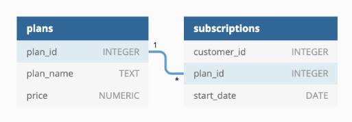

# CONTEXT 

Subscription based businesses are super popular and Danny realised that there was a large gap in the market - he wanted to create a new streaming service that only had food related content - something like Netflix but with only cooking shows!

Danny finds a few smart friends to launch his new startup Foodie-Fi in 2020 and started selling monthly and annual subscriptions, giving their customers unlimited on-demand access to exclusive food videos from around the world!

Danny created Foodie-Fi with a data driven mindset and wanted to ensure all future investment decisions and new features were decided using data. This case study focuses on using subscription style digital data to answer important business questions.

# DATASETS 

Six datasets : 
* plans 
* subscriptions 

# ERD



## TABLE 1 : Plans 

The `plans` table is composed of : 
- **plan_id** - PRIMARY KEY
- **plan_name** - Name of the plan or subscription
- **price** - Monthly price of the subscription


## TABLE 2 : Subscriptions 

The `subscriptions` table is composed of : 
- **customer_id** - PRIMARY KEY
- **plan_id** - FOREIGN KEY
- **start_date** - Starting date of the subscription


# CASE STUDY 

Before we are going to deep into this case study, we have to prepare our work with views (schema + views) : 

```sql
DROP SCHEMA IF EXISTS v_foodie_fi CASCADE; 
CREATE SCHEMA v_foodie_fi; 

DROP VIEW IF EXISTS v_foodie_fi.plans; 
CREATE VIEW v_foodie_fi.plans AS
SELECT * FROM foodie_fi.plans; 


DROP VIEW IF EXISTS v_foodie_fi.subscriptions; 
CREATE VIEW v_foodie_fi.subscriptions AS
SELECT * FROM foodie_fi.subscriptions; 
```

## Customer Journey

```sql
SELECT 
  customer_id, 
  plans.plan_id, 
  start_date, 
  plans.plan_name, 
  RANK() OVER(
    PARTITION BY customer_id
    ORDER BY start_date
  )
FROM v_foodie_fi.subscriptions
INNER JOIN v_foodie_fi.plans 
  ON subscriptions.plan_id = plans.plan_id
WHERE customer_id in (1, 2, 11, 13, 15, 16, 18, 19);
```


- **CUSTOMER 1**
Trial of 7 days then basic monthly subscription 
- **CUSTOMER 2**
Trial of 7 days then annual subscription
- **CUSTOMER 11**
Trial of 7 days then **churn** 
- **CUSTOMER 13**
Basic monthly subscription during 3 months then pro monthly subscription
- **CUSTOMER 15**
Trial of 7 days then pro monthly subscription for one month (**churn** after). 
- **CUSTOMER 16**
Trial of 7 days then basic monthly subscription and after 4 months annual subscription
- **CUSTOMER 18**
Trial of 7 days then pro monthly subscription
- **CUSTOMER 19**
Trial of 7 days then pro monthly subscription and annual subscription after 2 months. 

## Data Analysis Questions

## **Q1**

> How many customers has Foodie-Fi ever had?

```sql
SELECT 
  COUNT(DISTINCT customer_id) AS customers_number
FROM v_foodie_fi.subscriptions;
```


## **Q2**

> What is the monthly distribution of trial plan start_date values for our dataset - use the start of the month as the group by value

```sql
WITH cte_month_distribution AS (
  SELECT 
    *, 
    TO_CHAR(start_date, 'Month') AS month
  FROM v_foodie_fi.subscriptions
  WHERE plan_id = 0
)
SELECT 
  month, 
  COUNT(*) AS trials_number
FROM cte_month_distribution
GROUP BY 1
ORDER BY 2 DESC; 
```


## **Q3**

> What plan start_date values occur after the year 2020 for our dataset? Show the breakdown by count of events for each plan_name

```sql
SELECT 
  plans.plan_id, 
  plans.plan_name, 
  COUNT(*) AS events 
FROM v_foodie_fi.subscriptions
LEFT JOIN v_foodie_fi.plans
  ON subscriptions.plan_id =  plans.plan_id
WHERE start_date > '2020-12-31'
GROUP BY 1, 2
ORDER BY 1; 
```

## **Q4**

> What is the customer count and percentage of customers who have churned rounded to 1 decimal place?

```sql
WITH cte_flag_churn AS (
  SELECT 
    *, 
    CASE 
      WHEN plan_id = 4 THEN 1 
      ELSE 0
    END AS flag_churn 
  FROM v_foodie_fi.subscriptions
)
SELECT 
  flag_churn,
  COUNT(*) AS churn_count,
  ROUND( 
    100 * COUNT(*) / SUM(COUNT(*)) OVER(), 
    1
  ) AS churn_percentage
FROM cte_flag_churn
GROUP BY 1;
```

## **Q5**

> How many customers have churned straight after their initial free trial - what percentage is this rounded to the nearest whole number?
