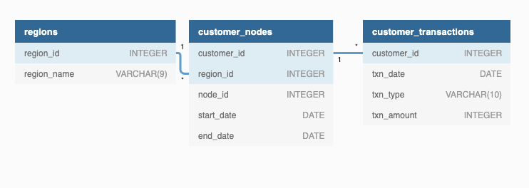
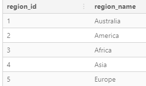
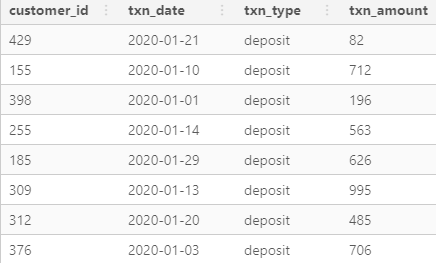
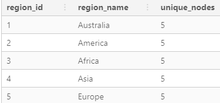
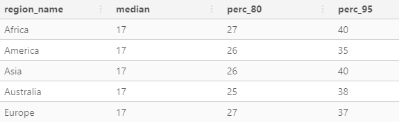
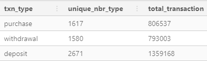
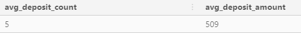
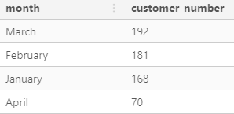

# Context

There is a new innovation in the financial industry called Neo-Banks: new aged digital only banks without physical branches.

Danny thought that there should be some sort of intersection between these new age banks, cryptocurrency and the data world…so he decides to launch a new initiative - Data Bank!

Data Bank runs just like any other digital bank - but it isn’t only for banking activities, they also have the world’s most secure distributed data storage platform!

Customers are allocated cloud data storage limits which are directly linked to how much money they have in their accounts. There are a few interesting caveats that go with this business model, and this is where the Data Bank team need your help!

The management team at Data Bank want to increase their total customer base - but also need some help tracking just how much data storage their customers will need.

This case study is all about calculating metrics, growth and helping the business analyse their data in a smart way to better forecast and plan for their future developments!


# DATASETS 

Three datasets : 
* regions
* customer_nodes
* customer_transactions

# ERD



## TABLE 1 : regions

The `regions` table is composed of : 
- **region_id** - PRIMARY KEY
- **region_name** - Continent name



## TABLE 2 : customer_nodes

The `customer_nodes` table is composed of : 
- **customer_id** - PRIMARY KEY
- **region_id** - FOREIGN KEY
- **node_id** - FOREIGN KEY 
- **start_date** 
- **end_date**


## TABLE 3 : customer_transactions

The `customer_transactions` table is composed of : 
- **customer_id** - FOREIGN KEY
- **txn_date** - Date of the transaction
- **txn_type** - Transaction type
- **txn_amount** - Amount of the transaction 




# CASE STUDY 

**LOAD INIT SQL FILE BEFORE TO INITIALIZE TABLES**

## Customer Nodes Exploration

## **Q1**

> How many unique nodes are there on the Data Bank system?

```sql
WITH combinations AS (
SELECT DISTINCT
  region_id,
  node_id
FROM data_bank.customer_nodes
)
SELECT COUNT(*) FROM combinations;
```
**25 nodes**
We can check further by region.

## **Q2**

> How many unique nodes are there on the Data Bank system?

```sql
SELECT 
  customer_nodes.region_id, 
  regions.region_name, 
  COUNT(DISTINCT node_id) AS unique_nodes
FROM data_bank.customer_nodes
INNER JOIN data_bank.regions
ON customer_nodes.region_id = regions.region_id
GROUP BY 1, 2; 
```


5 nodes by region

## **Q3**

> How many customers are allocated to each region?

```sql
SELECT 
  customer_nodes.region_id, 
  regions.region_name, 
  COUNT(DISTINCT customer_id) AS unique_nodes
FROM data_bank.customer_nodes
INNER JOIN data_bank.regions
ON customer_nodes.region_id = regions.region_id
GROUP BY 1, 2; 
```


## **Q4**

> How many days on average are customers reallocated to a different node?

```sql
DROP TABLE IF EXISTS ranked_customer_nodes; 
CREATE TEMP TABLE ranked_customer_nodes AS 
SELECT 
  customer_id,  
  node_id, 
  start_date, 
  end_date, 
  DATE_PART('day', AGE(end_date, start_date))::INTEGER AS duration, 
  ROW_NUMBER() OVER(
    PARTITION BY customer_id
    ORDER BY start_date
  ) AS _row_number 
FROM data_bank.customer_nodes; 

WITH RECURSIVE output_table AS(
  SELECT 
    customer_id, 
    node_id, 
    duration, 
    _row_number, 
    1 AS rn_id
  FROM ranked_customer_nodes 
  WHERE _row_number = 1 
  
  UNION ALL 
  
  SELECT 
    t1.customer_id, 
    t2.node_id, 
    t2.duration, 
    t2._row_number, 
    CASE
      WHEN t1.node_id != t2.node_id THEN t1.rn_id + 1
      ELSE t1.rn_id 
    END AS rn_id
  FROM output_table AS t1
  INNER JOIN ranked_customer_nodes AS t2
    ON t1._row_number + 1 = t2._row_number
    AND t1.customer_id = t2.customer_id 
    AND t2._row_number > 1
),
cte_nodes_duration AS (
  SELECT
    customer_id, 
    rn_id, 
    SUM(duration) AS node_duration
  FROM output_table
  GROUP BY 
    customer_id, 
    rn_id
)
SELECT 
  ROUND(AVG(node_duration)) AS avg_node_duration
FROM cte_nodes_duration;
```

**avg_node_duration** = 17

## **Q5**

> What is the median, 80th and 95th percentile for this same reallocation days metric for each region? 

We can use the previous query and create a temp table `nodes_duration`. 
We also can add `region_id` column and aggregate it to calculate the both percentiles. 

```sql 
SELECT 
  t2.region_name,
  PERCENTILE_CONT(0.50) WITHIN GROUP(ORDER BY node_duration) AS median,
  PERCENTILE_CONT(0.80) WITHIN GROUP(ORDER BY node_duration) AS perc_80,
  ROUND(PERCENTILE_CONT(0.95) WITHIN GROUP(ORDER BY node_duration)) AS perc_95
FROM nodes_duration AS t1
INNER JOIN data_bank.regions AS t2
  ON t1.region_id = t2.region_id
GROUP BY t2.region_name
ORDER BY 1;
```



## Customer Transactions 

## **Q1**

> What is the unique count and total amount for each transaction type?

```sql
SELECT 
  txn_type, 
  COUNT(DISTINCT txn_amount) AS unique_nbr_type, 
  SUM(txn_amount) AS total_transaction
FROM data_bank.customer_transactions
GROUP BY 1; 
```


## **Q2**

> What is the average total historical deposit counts and amounts for all customers?

```sql 
WITH cte_customer AS(
  SELECT 
    customer_id, 
    COUNT(*) AS deposit_count, 
    SUM(txn_amount) AS deposit_amount 
  FROM data_bank.customer_transactions
  WHERE txn_type = 'deposit'
  GROUP BY 1
)
SELECT
  ROUND(AVG(deposit_count)) AS avg_deposit_count, 
  ROUND(AVG(deposit_amount)/AVG(deposit_count)) AS avg_deposit_amount 
FROM cte_customer; 
```


## **Q3**

> For each month - how many Data Bank customers make more than 1 deposit and either 1 purchase or 1 withdrawal in a single month?

```sql
WITH cte_txn_number AS(
  SELECT 
    customer_id,
    SUM(CASE WHEN txn_type = 'deposit' THEN 1 ELSE 0 END) AS deposit_count, 
    SUM(CASE WHEN txn_type = 'withdrawal' THEN 1 ELSE 0 END) AS withdrawal_count, 
    SUM(CASE WHEN txn_type = 'purchase' THEN 1 ELSE 0 END) AS purchase_count, 
    DATE_PART('month', txn_date) AS month
  FROM data_bank.customer_transactions
  GROUP BY customer_id, month
)
SELECT 
  CASE 
    WHEN month = 1 THEN 'January'
    WHEN month = 2 THEN 'February'
    WHEN month = 3 THEN 'March'
    ELSE 'April'
  END AS month,
  COUNT(DISTINCT customer_id) AS customer_number
FROM cte_txn_number
WHERE deposit_count > 1 AND (
  withdrawal_count >= 1 OR purchase_count >= 1
)
GROUP BY month
ORDER BY customer_number DESC; 
```



## **Q4**

> What is the closing balance for each customer at the end of the month?

```sql
DROP TABLE IF EXISTS customer_balance; 
CREATE TEMP TABLE customer_balance AS (
  SELECT 
    customer_id, 
    txn_date,
    txn_type, 
    CASE 
      WHEN txn_type = 'deposit' THEN txn_amount
      ELSE -txn_amount
    END AS txn_amount,
    ROW_NUMBER() OVER(
      PARTITION BY customer_id
      ORDER BY txn_date
    ) AS _row_number
  FROM data_bank.customer_transactions
); 

DROP TABLE IF EXISTS customer_actual_balance;
CREATE TEMP TABLE customer_actual_balance AS (
 WITH RECURSIVE output_table AS (
  SELECT 
    customer_id, 
    txn_date,
    txn_amount,
    txn_amount AS balance,
    _row_number
  FROM customer_balance 
  WHERE _row_number = 1 

  UNION ALL 
  
    SELECT 
    t1.customer_id, 
    t2.txn_date, 
    t2.txn_amount,
    t1.balance + t2.txn_amount AS balance, 
    t2._row_number
  FROM output_table AS t1
  INNER JOIN customer_balance AS t2
    ON t1._row_number + 1 = t2._row_number
    AND t1.customer_id = t2.customer_id 
    AND t2._row_number > 1
  ), 
  cte_balance AS (
    SELECT 
    customer_id, 
    txn_date,
    DATE_PART('month', txn_date) AS month, 
    SUM(txn_amount) AS balance_contribution, 
    MAX(balance) AS balance
  FROM output_table
  GROUP BY customer_id, txn_date
  )
  SELECT 
    customer_id, 
    txn_date, 
    month, 
    balance_contribution, 
    balance, 
    ROW_NUMBER() OVER( 
      PARTITION BY month, customer_id
      ORDER BY txn_date
    ) AS rn
  FROM cte_balance
  ORDER BY customer_id, txn_date
);

SELECT * FROM customer_actual_balance;
```