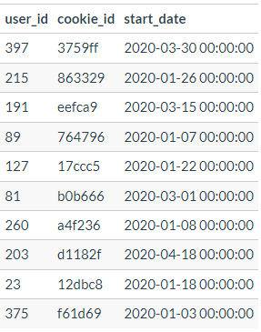

# Context

Clique Bait is not like your regular online seafood store - the founder and CEO Danny, was also a part of a digital data analytics team and wanted to expand his knowledge into the seafood industry!

In this case study - you are required to support Danny’s vision and analyse his dataset and come up with creative solutions to calculate funnel fallout rates for the Clique Bait online store.

# DATASETS 

Five dataset : 
* users
* events
* event identifier
* campaign identifier
* page hierarchy

## TABLE 1 : users

The `users` table is composed of : 
- user_id : Unique ID for user (customer)
- cookie_id : ID of the cookie associate fpor a specific user
- start_date : Start date for the cookie



## TABLE 2 : events

The `events` table is composed of : 
- visit_id : Unique ID of a website visit 
- cookie_id : cookie ID 
- page_id : page ID 
- event_type : Reference to the `event identifier` table 
- sequence_number : Order the events within each visit
- event_time : Datetime of the event 


## TABLE 3 : event identifier

The `event identifier` table is composed of : 
- event_type : Reference to the events table 
- event_name : event's name


## TABLE 4 : campaign identifier

The `campaign identifier` table is composed of : (three campaigns) 
- campaign_id : ID of the campaign
- products : Products concerned by the campaign 
- campaign_name : campaign's name 
- start_date 
- end_date 


## TABLE 5 : page hierarchy

The `page hierarchy` table is composed of :
- page_id : page ID 
- page_name : page's name 
- product_category : category of the visited product
- product_id : product ID 


# ERD 


# CASE STUDY 

**LOAD INIT SQL FILE BEFORE TO INITIALIZE TABLES**

## Digital Analysis 

## **Q1**

> How many users are there?

```sql
SELECT 
  COUNT(DISTINCT user_id) AS unique_user_number
FROM `clique_bait.users`;
```
**500**

## **Q2**

> How many cookies does each user have on average?

```sql
WITH cte_cookies_number_by_user AS (
  SELECT 
    user_id, 
    COUNT(cookie_id) AS cookie_number
  FROM `clique_bait.users`
  GROUP BY user_id
) 
SELECT 
  ROUND(AVG(cookie_number), 2) AS average_cookie_by_user
FROM cte_cookies_number_by_user 
```
**3.56**

## **Q3**

> What is the unique number of visits by all users per month?

```sql
SELECT 
  DATE(DATE_TRUNC(event_time, MONTH)) AS month, 
  COUNT(DISTINCT visit_id) AS unique_visit_number
FROM clique_bait.events
LEFT JOIN clique_bait.users
ON events.cookie_id = users.cookie_id
GROUP BY 
  month
ORDER BY 
  month; 
```


## **Q4**

> What is the number of events for each event type?

```sql
SELECT 
  event_identifier.event_name, 
  COUNT(events.event_type) AS events_number 
FROM `clique_bait.events` AS events
LEFT JOIN `clique_bait.event_identifier` AS event_identifier
ON events.event_type = event_identifier.event_type
GROUP BY 
  event_identifier.event_name; 
```


## **Q5**

> What is the percentage of visits which have a purchase event?

